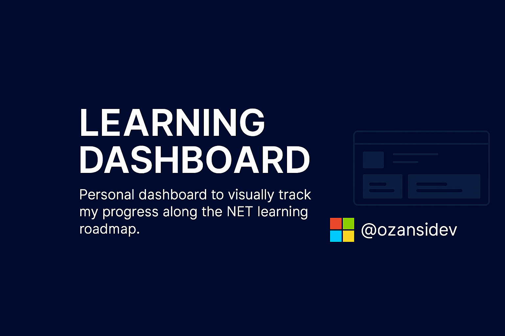

# 📘 Learning Dashboard – Personal Progress Tracker



> A personal dashboard built with Astro to visually track my progress along the .NET learning roadmap.  
> It organizes daily tasks, completed modules, checkpoints, and notes in a clean, responsive, and serverless interface.

---

## 🌍 Avalaible Languages

[](README.es.md)
[](README.md)

## 🚀 Tech Stack

- 🧠 [Astro](https://astro.build/) – Modern frontend framework
- 🎨 [Tailwind CSS](https://tailwindcss.com/) – Fast, responsive UI design
- 📅 [FullCalendar.js](https://fullcalendar.io/) – Interactive calendar for scheduling
- 🔄 [SortableJS](https://sortablejs.github.io/Sortable/) – Drag & Drop task management
- 💾 LocalStorage – Client-side persistence
- ✏️ Markdown – Weekly note-taking in editable format

---

## 📊 Core Features

- Summary panel with KPIs: overall progress, active days, checkpoints
- Daily calendar with scheduled tasks and quick overview
- Detailed per-day view with draggable task system
- Checkpoint tracker and weekly notes section
- Fully offline setup — no backend or database required

---

## 🐙 Deployment

  -  [](https://app.netlify.com/projects/netlearning-dashboard/deploys)
  -  [🌐 .NET Learning Dashboard](https://netlearning-dashboard.netlify.app/)

---

## 🛠️ Installation

```bash
git clone https://github.com/TU_USERNAME/learning-dashboard.git
cd learning-dashboard
npm install
npm run dev
