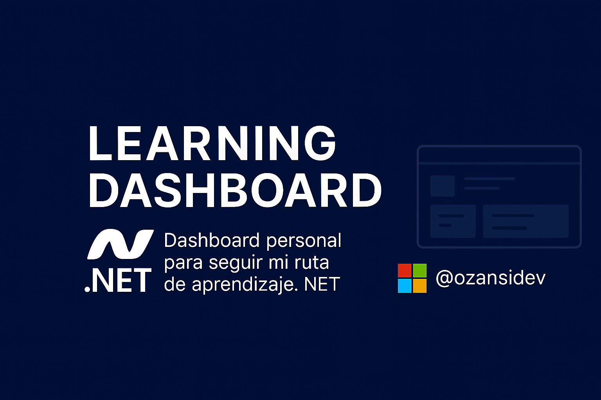

# 📘 Learning Dashboard .NET – Seguimiento Personal



> Dashboard web creado con Astro para visualizar mi progreso en la ruta de aprendizaje de desarrollo con .NET.  
> Administra tareas diarias, checkpoints, módulos completados y notas personales, todo desde una interfaz clara, responsiva y sin necesidad de backend.

---

## 🚀 Tecnologías utilizadas

- 🧠 [Astro](https://astro.build/) – Framework moderno de frontend
- 🎨 [Tailwind CSS](https://tailwindcss.com/) – Diseño rápido y responsive
- 📅 [FullCalendar.js](https://fullcalendar.io/) – Calendario interactivo
- 🔄 [SortableJS](https://sortablejs.github.io/Sortable/) – Drag & Drop entre tareas
- 💾 LocalStorage – Persistencia sin servidor
- ✏️ Markdown – Notas semanales en formato editable

---

## 📊 Funcionalidades destacadas

- Panel resumen con KPIs: progreso total, días activos, checkpoints
- Calendario diario con vista detallada y tareas programadas
- Vista por día con sistema de tareas arrastrables (drag & drop)
- Gestor de checkpoints y notas semanales
- Proyecto 100% offline, sin necesidad de base de datos o backend

---

## 🛠️ Instalación

```bash
git clone https://github.com/ozasnidev/learning-dashboard.git
cd learning-dashboard
npm install
npm run dev